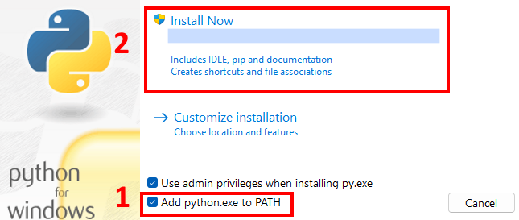

From Release File (Windows)
---------------------------

Tested for Windows11

- Make sure to have `python <https://www.python.org/downloads/windows/>`_ (3.11 suggested) installed on your system and available in the PATH (There is a checkbox that you need to tick as soon as you run the installer to automatically do this).

- From :github:`github <releases/>` download the :github:`release file <releases/latest/download/run_server.zip>`
- Extract the content of the zip file in a folder of your choice
- Run the :code:`run_server.exe` file
- Unzip the release file downloaded in the previous step.
- From inside the folder, run the :code:`run-user.bat` file that will

  - Create or reuse a virtual environment in the folder :code:`venv` in the same directory as the script
  - Install the required packages to run the server
  - Start the server

The server will run with sensible defaults.
Most notably the models files, plugin files (needed python packages) and database will be downloaded/created under :code:`%userprofile%/.ocr_translate`.
If not DEVICE is specified, the server will attempt to find the :code:`nvidia-smi` executable and if available, will run on GPU.

For customization, you can set the :doc:`Environment variables <../user/envs>` yourself.

Since the introduction of the :code:`run-user.bat` script, this has been made easier as you just need to edit that file
with any text editor and set the environment variables at the top of the file

.. code-block:: bat

    @echo off

    set LOAD_ON_START=

    set DEVICE=cpu
    set OCT_BASE_DIR=
    set DATABASE_NAME=

    set DJANGO_DEBUG=false
    set DJANGO_LOG_LEVEL=INFO

    call run.bat

You can see some of them already set to their default values or nothing, meaning they are left undefined.

The `call run.bat` calls the secondary script with the boilerplate code to start the server.
